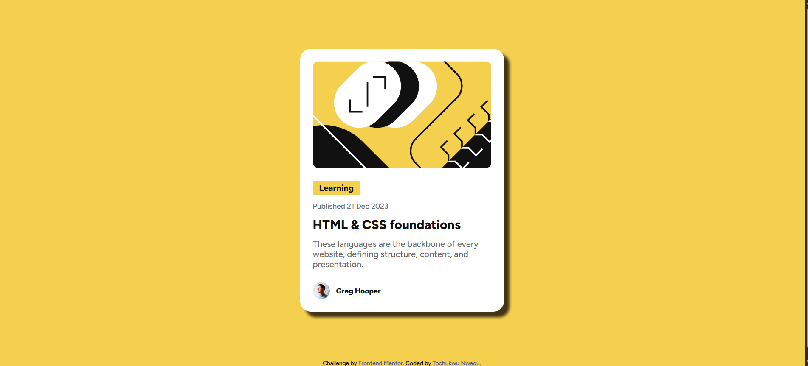
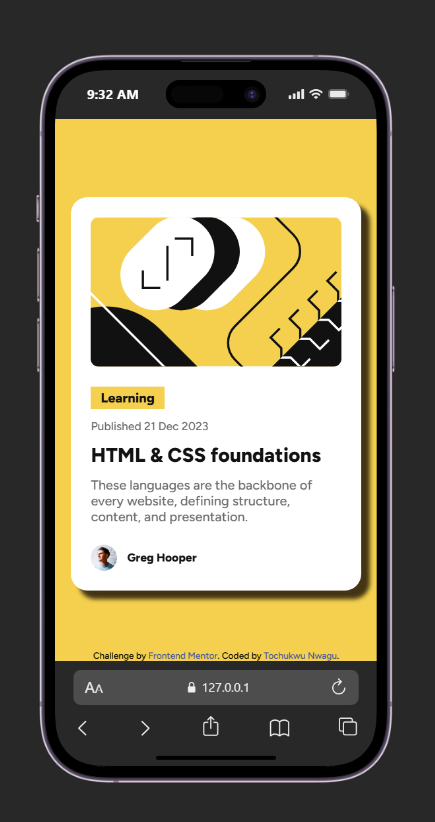

# Frontend Mentor - Blog preview card solution

This is a solution to the Blog preview card challenge on Frontend Mentor(https://www.frontendmentor.io/challenges/blog-preview-card-ckPaj01IcS). Frontend Mentor challenges help you improve your coding skills by building realistic projects. 

## Table of contents

- [Overview](#overview)
  - [The challenge](#the-challenge)
  - [Screenshot](#screenshot)
  - [Links](#links)
- [My process](#my-process)
  - [Built with](#built-with)
  - [What I learned](#what-i-learned)
  - [Continued development](#continued-development)
  - [Useful resources](#useful-resources)
- [Author](#author)
- [Acknowledgments](#acknowledgments)


## Overview

### The challenge

Users should be able to:

- See hover and focus states for all interactive elements on the page

### Screenshot





### Links

- Link to github repository: (https://github.com/Tochi-Nwagu/frontend_mentor_blog_preview_card)
- Link to hosted site on github pages: (https://tochi-nwagu.github.io/frontend_mentor_blog_preview_card/)

## My process

### Built with

- Semantic HTML5 markup
- CSS custom properties
- Flexbox
- Mobile-first workflow


### What I learned

Most of the concepts used in this project were not entirely new to me, but building the card helped me practise and reinforce them. The main new thing I learned was how to add custom fonts locally using @font-face CSS rule for adding custom fonts.

During the build, I also:

Practised using positioning to ensure that my footer is placed at the end of the webpage  based on feedback from my previous QR Code challenge.
Continued improving my approach to responsive design by using relative sizing instead of relying solely on fixed pixel values.
Revisited the box-shadow property and became more comfortable recreating shadows from a design mock-up.
And how to reduce font size for smaller screens without using media queries.


```css
for adding already downloaded fonts from the folder using the @font-face CSS Rule as shown in the code snippet below.
@font-face {
  font-family: 'Figtree';
  src: url('./assets/fonts/static/Figtree-ExtraBold.ttf') format('truetype');
  font-weight: 800;
  font-style: normal;
}

Using box-shadow to add the shadow
.cards {
  background-color: hsl(0, 0%, 100%);
  padding: 24px;
  border-radius: 20px;
  box-shadow: 10px 10px 5px 0 rgba(9, 0, 0, 0.75);
  max-width: 100%;
}

Using relative sizing instead of fixed value
.container {
  width: 90%;
  max-width: 384px;
  margin: 0 auto;
  padding: 96px 0;
  margin-bottom: 24px;
}

Using positon to syle my footer
.attribution {
  font-size: 0.6875rem;
  text-align: center;
  position: fixed;
  bottom: 0;
  left: 0;
  width: 100%;
}

example of how get the font-size to reduce based on screen size without media query
.description {
  font-size: clamp(0.875rem, 0.7857rem + 0.381vw, 1rem);
  font-weight: 500;
  color: hsl(0, 0%, 42%);
}

```


### Continued development

In future projects, I want to continue improving my responsive design skills by relying more on flexible sizing techniques rather than fixed dimensions. I also plan to become more comfortable working with custom fonts and recreating design details such as shadows and spacing with greater accuracy.

Additionally, I would like to further explore CSS positioning and layout techniques to build more polished and adaptable user interfaces across different screen sizes.

### Useful resources

- [resource 1](https://css-tricks.com/) - This helped me with everything flexbox. I really liked using it as it broke down everything concerning CSS.

- [resource 2](https://css-tricks.com/almanac/rules/f/font-face/) - This is an amazing article which helped me finally understand how to implement adding fonts from a downloaded/ included folder. I'd recommend it to anyone still learning this concept.

- [resource 3](https://stackoverflow.com/questions/35978790/bigger-fonts-on-smaller-screens-without-media-queries-or-javascript) - This is an amazing resource that helped me understand how I can to reduce font size for smaller screens without using media queries. And (https://clamp.font-size.app/) was the website i used to convert it.


## Author

- Website - [Tochi Nwagu](https://tochi-nwagu.github.io/frontend_mentor_blog_preview_card/)
- Frontend Mentor - [@Tochi-Nwagu](https://www.frontendmentor.io/profile/Tochi-Nwagu)


## Acknowledgments

Thanks to Frontend Mentor for providing real-world frontend challenges that help developers improve their coding skills.
